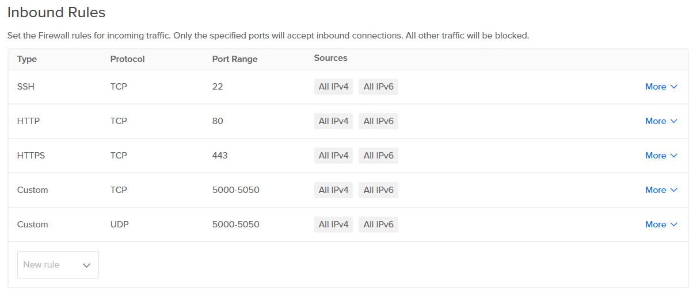

# Setup a Development Server on Digital Ocean
1. Start up a new Digital Ocean Droplet (use Marketplace Droplet: MySQL droplet [it already has MySQL pre-installed, please trust me]). You'll need at least 2 GB of RAM to build the React site on the server. The steps below were tested using Ubuntu 20.04.
2. After that, go to your Digital Ocean dashboard and on the left sidebar click **Networking**. Click on the **Firewall** tab and create a firewall. Your firewall should looks like this: 
3. As the root user, run:
```
apt update
apt upgrade
```
4. Upload the `schema.sql` file to the droplet.
5. Run `mysql`, then in the MySQL command prompt run:
```sql
CREATE DATABASE elle_database;
USE elle_database;
source schema.sql;
CREATE USER 'elle'@'localhost' IDENTIFIED BY 'INSERT_PASSWORD';
GRANT INSERT, UPDATE, DELETE, SELECT ON elle_database.* TO 'elle'@'localhost';
```
  * Ensure the permissions were granted to the new user by running `SHOW GRANTS for 'elle'@'localhost';`
6. Install a Redis database by running:
```
apt install redis-server
```
7. Edit the following line in `/etc/redis/redis.conf`:
```diff
-supervised no
+supervised systemd
```
8. Restart the Redis service, then verify that it's running with:
```
systemctl restart redis.service
systemctl status redis
```
  * If you encounter any problems installing it, refer to the guide I followed: https://www.digitalocean.com/community/tutorials/how-to-install-and-secure-redis-on-ubuntu-20-04
6. Run:
```
apt install nodejs npm
apt install python3
apt install python3-pip
```
6. Clone the GitHub repo: `git clone https://github.com/Naton-1/ELLE-2023-Website-API.git` into this directory: `/var/www/`
7. Go into `ELLE-2023-Website-API/` and create the following folders:
* `audios`
* `images`
* `deletes`
* `temp_uploads`
8. Then install the Python requirements:
```
pip3 install -r requirements.txt
```
8. Create a environment variable file in the same directory:
```
touch .env
```
9. Paste this content into the file, replacing "INSERT_PASSWORD" with the MySQL user password you created in step 4:
```
MYSQL_DATABASE_USER = 'elle'
MYSQL_DATABASE_PASSWORD = 'INSERT_PASSWORD'
MYSQL_DATABASE_DB = 'elle_database'
MYSQL_DATABASE_HOST = 'localhost'
SECRET_KEY = 'ian'
```
  * Note: What `SECRET_KEY` does is a mystery
10. Edit this React file: `ELLE-2023-Website-API/templates/src/components/Modules/Term.js`. Change the following, replacing the filler text with your droplet's IP address:
```
let imgLink = "https://chdr.cs.ucf.edu/elle" + this.props.card.imageLocation; --> let imgLink = "http://[INSERT_IP_ADDRESS]" + this.props.card.imageLocation;
let audioLink = "https://chdr.cs.ucf.edu/elle" + this.props.card.audioLocation; --> let audioLink = "http://[INSERT_IP_ADDRESS]" + this.props.card.audioLocation;
```
11. Go to `ELLE-2023-Website-API/templates/public/` and create a htaccess file:
```
touch .htaccess
```
12. Paste this content into the file:
```
Options -MultiViews
RewriteEngine On
RewriteCond %{REQUEST_FILENAME} !-f
RewriteRule ^ index.html [QSA,L]
```
10. Go to `ELLE-2023-Website-API/templates` then build the React website:
```
npm install
npm run build
```
11. Launch a new screen so you can keep the API running while doing other things inside the SSH session:
```
screen
```
12. Finally, to launch the API go into `ELLE-2023-Website-API/` then run
```
python3 __init__.py
```
13. Press `Ctrl + Alt + D` to get out of the screen while leaving the API running.
14. Now we need to configure an Apache site file so our site serves up the correct content. Go to `/etc/apache2/sites-available` and create a site file:
```
touch elle-flask-app.conf
```
15. Paste this content into the file:
```
<VirtualHost *:80>
    ServerName INSERT_YOUR_DROPLET'S_IP_ADDRESS
    DocumentRoot /var/www/ELLE-2023-Website-API/templates/build

    <Directory /var/www/ELLE-2023-Website-API/templates/build>
        Options FollowSymLinks MultiViews
        AllowOverride All
        Order allow,deny
        Allow from all
    </Directory>
    
    Alias /images /var/www/ELLE-2023-Website-API/images
    <Directory /var/www/ELLE-2023-Website-API/images>
        Order allow,deny
        Allow from all
    </Directory>
    
    Alias /images /var/www/ELLE-2023-Website-API/audios
    <Directory /var/www/ELLE-2023-Website-API/audios>
        Order allow,deny
        Allow from all
    </Directory>

    ErrorLog ${APACHE_LOG_DIR}/error.log
    LogLevel warn
    CustomLog ${APACHE_LOG_DIR}/access.log combined
</VirtualHost>
```
16. Activate `mod_rewrite` Apache feature to prevent unintentional React Router 404 pages:
```
a2enmod rewrite
```
16. Enable the site file:
```
a2ensite elle-flask-app
sudo systemctl reload apache2
```
17. You should now be able to go to your droplet's IP address and see the ELLE site up.

## Troubleshooting
If you can't connect to the API, check that the Ubuntu firewall isn't blocking the API port:
```
$ ufw status
22/tcp                     LIMIT       Anywhere
Apache Full                ALLOW       Anywhere
3306/tcp                   ALLOW       Anywhere
22/tcp (v6)                LIMIT       Anywhere (v6)
Apache Full (v6)           ALLOW       Anywhere (v6)
3306/tcp (v6)              ALLOW       Anywhere (v6)
```

# Notes
### Existing endlesslearner.com server
* They use Gunicorn and setup the API as a systemctl service
* They use Nginx

### Important config options
`__init__.py`
```python
# Change URL prefix of the API e.g. https://chdr.cs.ucf.edu/elleapi
API_ENDPOINT_PREFIX = '/elleapi/'

# Change port the API runs on
app.run(host='0.0.0.0', port='5050', debug=True)
```

`/templates/src/App.js`
```js
let flaskIP = 'https://chdr.cs.ucf.edu/elleapi';
```

### CHDR Server specific edits done
`__init__.py`
```python
API_ENDPOINT_PREFIX = '/'
```

`/templates/src/App.js`
```js
let flaskIP = 'https://chdr.cs.ucf.edu/elleapi';
```

`App.js`
```diff
-<Router>  
+<Router basename='/elle/'>  
```

`/templates/package.json`
```diff
   "devDependencies": {
     "json-loader": "^0.5.7"
   },
+  "homepage": "https://chdr.cs.ucf.edu/elle"
 }
```
More info about this here: https://create-react-app.dev/docs/deployment/#building-for-relative-paths.