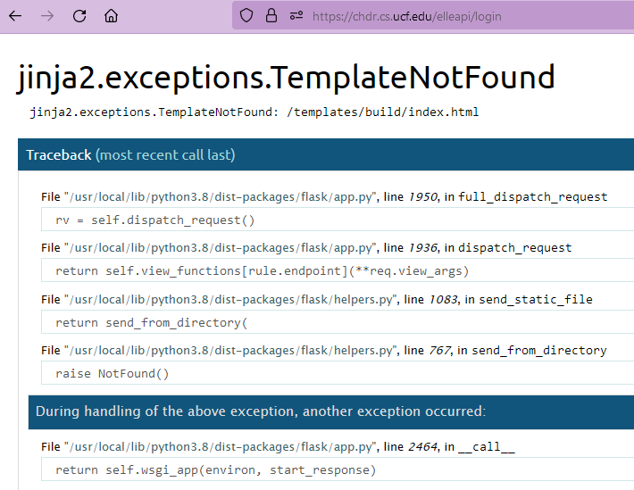

# Setup a Development Server on Digital Ocean
1. Start up a new Digital Ocean Droplet (use Marketplace Droplet: MySQL droplet [it already has MySQL pre-installed, please trust me]). You'll need at least 2 GB of RAM to build the React site on the server. The steps below were tested using Ubuntu 22.04.
2. As the root user, run `apt update` then `apt upgrade`.
3. Upload the `schema.sql` file to the droplet.
4. Run `mysql`, then in the MySQL command prompt run:
```sql
CREATE DATABASE elle_database;
USE elle_database;
source schema.sql;
CREATE USER 'elle'@'localhost' IDENTIFIED BY '[INSERT PASSWORD!]';
GRANT INSERT, UPDATE, DELETE, SELECT ON elle_database.* TO 'elle'@'localhost';
```
  * Ensure the permissions were granted to the new user by running `show grants for 'elle'@'localhost';`
5. Run:
```
apt install nodejs npm
apt install python3
apt install python3-pip
```
6. Clone the GitHub repo: `git clone https://github.com/Naton-1/ELLE-2023-Website-API.git`
7. Go into `ELLE-2023-Website-API/templates` then build the React website:
```
npm install
npm run build
```
8. Go into `ELLE-2023-Website-API/` then install the Python requirements:
```
pip3 install -r requirements.txt
```
9. Launch a new screen in order to keep the API running while doing other things inside the SSH session:
```
screen
```
10. Finally, to launch the API go into `ELLE-2023-Website-API/` then run
```
python3 __init__.py
```
11. Press `Ctrl + Alt + D` to get out of the screen while leaving the API running.

TODO: Write Apache section.

## Troubleshooting
If you can't connect to the API, check that the Ubuntu firewall isn't blocking the API port:
```
$ ufw status
22/tcp                     LIMIT       Anywhere
Apache Full                ALLOW       Anywhere
3306/tcp                   ALLOW       Anywhere
22/tcp (v6)                LIMIT       Anywhere (v6)
Apache Full (v6)           ALLOW       Anywhere (v6)
3306/tcp (v6)              ALLOW       Anywhere (v6)
```

If you are trying to send GET requests to API endpoints (why though?) and see this:


Simply make the following change in `__init__.py`:
```python
...render_template('/templates/build/index.html')... -> ...render_template('build/index.html')
```

# Notes
### Existing endlesslearner.com server
* They use Gunicorn and setup the API as a systemctl service
* They use Nginx

### Migrating to chdr.cs.ucf.edu
Change this in `/templates/package.json`:
```
react-scripts build ==> PUBLIC_URL=/elle/ react-scripts build
```

### Important config options
`__init__.py`
```python
API_ENDPOINT_PREFIX = '/api/'
```

`/templates/src/App.js`
```js
let flaskIP = 'https://endlesslearner.com/api';
```

`/templates/package.json`
```json
"build": "PUBLIC_URL=/elle/ react-scripts build"
```
This is really only used for a shared domain. With this config for example, instead of `http://BASE_URL/` displaying the home page, `http://BASE_URL/elle` would. And instead of `http://BASE_URL/api` being the API endpoint, `http://BASE_URL/elle/api` would.